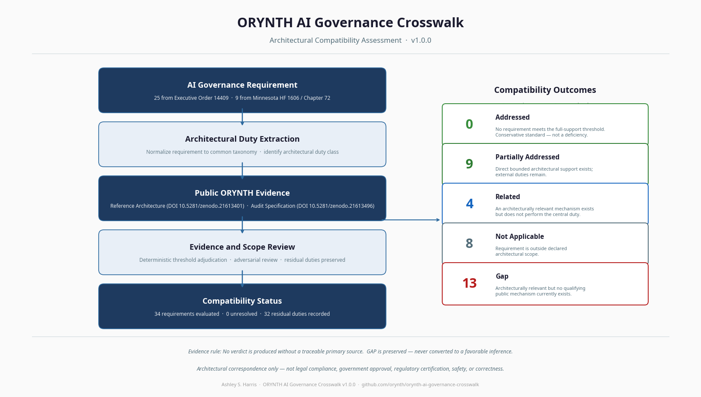
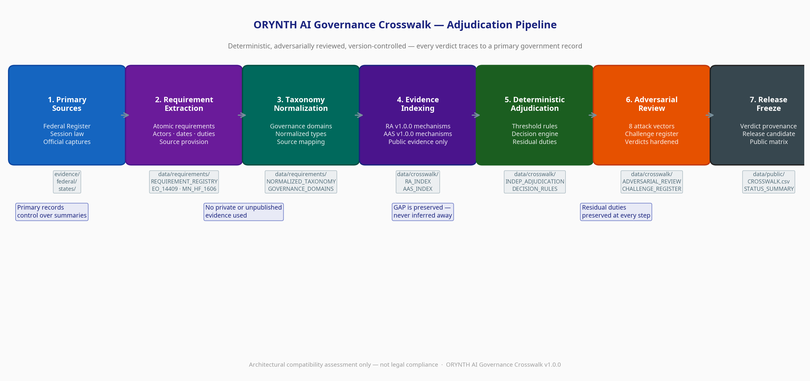
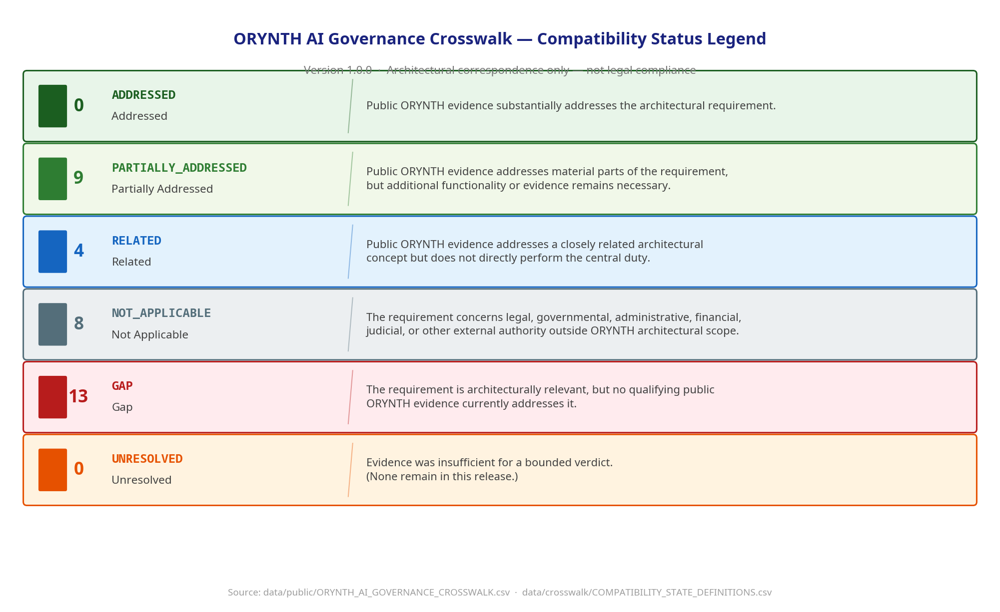

# ORYNTH AI Governance Crosswalk

**An evidence-based compatibility matrix mapping selected AI governance requirements to publicly available ORYNTH architectural evidence.**

Version 1.0.0 — Public Proof Reference

---

## What this is

The ORYNTH AI Governance Crosswalk evaluates architectural correspondence between selected United States AI-governance requirements and mechanisms publicly defined in the ORYNTH Reference Architecture (v1.0.0) and Architectural Audit Specification (v1.0.0).

Every determination is evidence-based, traceable to a primary source, and version-controlled. The row-level matrix is the source of truth; every summary and statistic in this repository is derived from it.

## What this is not

This project does **not**:

- establish legal or regulatory compliance;
- provide legal advice;
- establish government approval or regulatory certification;
- certify any implementation, or guarantee safety or correctness;
- replace governmental, regulatory, or judicial authority.

Three ideas are kept strictly separate throughout: **architectural correspondence**, **legal compliance**, and **governmental authority**. This crosswalk speaks only to the first.

## Findings

The bounded release evaluates **34 atomic requirements** — 25 from Executive Order 14409 and 9 from Minnesota HF 1606 / Chapter 72.

| Verdict | Count | Share |
|---|---:|---:|
| ADDRESSED | 0 | 0.00% |
| PARTIALLY_ADDRESSED | 9 | 26.47% |
| RELATED | 4 | 11.76% |
| NOT_APPLICABLE | 8 | 23.53% |
| GAP | 13 | 38.24% |
| UNRESOLVED | 0 | 0.00% |

- **9** requirements are partially addressed (direct bounded architectural support exists).
- **4** requirements are related (an architecturally relevant mechanism exists).
- **8** requirements are outside architectural scope.
- **13** requirements are architectural evidence gaps.
- **0** requirements are claimed as fully addressed.
- **0** requirements are unresolved.

### The zero "Addressed" findings

Zero fully addressed findings is deliberate. The adjudication reports architectural correspondence only where the public evidence supports it; it does not round partial support up to full support, and it does not manufacture coverage. The **13 gaps are a valid research result** — they show where no qualifying public mechanism yet exists. A conservative evidence standard produces a trustworthy matrix, not a failed project.

## How the crosswalk works

Requirements are extracted from primary sources, normalized to a common taxonomy, matched against indexed public ORYNTH evidence, adjudicated deterministically, adversarially reviewed, and frozen into the release candidate and verdict provenance. Residual duties are preserved at every step.

## How to read the matrix

The canonical matrix is `data/public/ORYNTH_AI_GOVERNANCE_CROSSWALK.csv`. Each row is one atomic requirement and records the source provision, the normalized requirement, the assigned public ORYNTH evidence, the compatibility verdict, the residual duties that remain external, and a confidence level. 

The six compatibility states are defined in the legend below:

## Repository navigation

- **[Canonical Matrix](data/public/ORYNTH_AI_GOVERNANCE_CROSSWALK.csv)**: The primary row-level crosswalk.
- **[Evidence Registry](data/crosswalk/ORYNTH_EVIDENCE_USE_LEDGER.csv)**: The ledger mapping requirements to specific architectural evidence.
- **[Methodology](docs/methodology/COMPATIBILITY_ADJUDICATION_PROTOCOL.md)**: The rules governing extraction, normalization, and adjudication.
- **[Primary Sources](evidence/)**: Official government records (Federal Register, session laws) and ORYNTH public artifacts.
- **[Key Findings](docs/release/PUBLIC_KEY_FINDINGS.md)**: Detailed statistical and strategic findings.
- **[Executive Summary](docs/release/EXECUTIVE_SUMMARY.md)**: A concise narrative overview of the release.

## Limitations

This is a selected enacted-law and executive-action backbone, not a national survey. It does not claim complete federal or 50-state coverage. Broader federal and multi-state expansion is reserved for later, evidence-controlled releases.

## Citation and Authorship

**Author:** Ashley S. Harris  
**Project:** ORYNTH AI Governance Crosswalk v1.0.0

**ORYNTH Public Evidence Base:**
- ORYNTH Reference Architecture: Execution Assurance Architecture for Adaptive Systems (v1.0.0). DOI: [10.5281/zenodo.21613401](https://doi.org/10.5281/zenodo.21613401)
- ORYNTH Architectural Audit Specification (v1.0.0). DOI: [10.5281/zenodo.21613496](https://doi.org/10.5281/zenodo.21613496)

## License

See [`LICENSE`](LICENSE). Documentation and data are released for public review; primary-source materials remain the property of their issuing governments.

---

*This assessment does not establish or guarantee safety, correctness, legal compliance, government approval, regulatory certification, or statutory satisfaction. It is architectural compatibility evidence only.*
